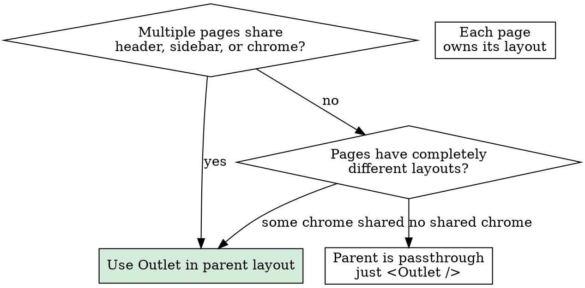

# Outlet Layout Patterns

## Core Principle

**Parent routes declare layout structure. `Outlet` handles child composition. Never use `useLocation()` or `useMatches()` for conditional rendering of child content.**

The purpose of nested routing is structural composition, not conditional content switching. When you find yourself checking `location.pathname` to decide what to render, you're bypassing the router's built-in composition model.

## When to Use

- Building a section with multiple sub-pages sharing the same chrome (sidebar, header, nav)
- Deciding how to structure parent-child routes
- Switching content based on URL (use Outlet, not `useLocation` switch/case)
- Highlighting active links in sidebar navigation

## The Pattern

```
Parent layout                    Child routes render here
┌─────────────────────────────┐  ┌──────────────────────┐
│ Header                      │  │ Dashboard stats      │
│ ─────────────────────────── │  └──────────────────────┘
│ Sidebar                     │  ┌──────────────────────┐
│ • Dashboard (active)        │  │ Settings form         │
│ • Settings                  │  └──────────────────────┘
│                             │  ┌──────────────────────┐
│ <Outlet />                  │  │ Users table           │
│                             │  └──────────────────────┘
└─────────────────────────────┘
```

### File Structure

```
app/routes/
├── admin.tsx              # Layout wrapper (sidebar, header, Outlet)
├── admin._index.tsx       # /admin → renders inside Outlet
├── admin.users.tsx        # /admin/users → renders inside Outlet
└── admin.settings.tsx     # /admin/settings → renders inside Outlet
```

### Parent Layout (`admin.tsx`)

```tsx
import { NavLink, Outlet } from "react-router";

export default function AdminLayout() {
  return (
    <div className="flex min-h-screen">
      <aside className="w-64 border-r p-4">
        <nav className="space-y-1">
          <NavLink to="/admin" end
            className={({ isActive }) =>
              isActive ? "text-blue-600 font-semibold" : "text-gray-600 hover:text-gray-900"
            }>
            Dashboard
          </NavLink>
          <NavLink to="/admin/users"
            className={({ isActive }) =>
              isActive ? "text-blue-600 font-semibold" : "text-gray-600 hover:text-gray-900"
            }>
            Users
          </NavLink>
          <NavLink to="/admin/settings"
            className={({ isActive }) =>
              isActive ? "text-blue-600 font-semibold" : "text-gray-600 hover:text-gray-900"
            }>
            Settings
          </NavLink>
        </nav>
      </aside>
      <main className="flex-1 p-6">
        <Outlet />
      </main>
    </div>
  );
}
```

### Child Pages (`admin._index.tsx`)

```tsx
export default function AdminIndex() {
  return (
    <div>
      <h1 className="text-2xl font-bold mb-4">Dashboard</h1>
      <p>Stats cards go here.</p>
    </div>
  );
}
```

**Children only contain their unique content.** They do NOT wrap themselves in the shared layout.

## Decision Flowchart



## NavLink Pattern

**Always use `NavLink` for active link highlighting.** It handles path matching automatically.

```tsx
// Use `end` on index routes so /admin doesn't match /admin/users
<NavLink to="/admin" end>Dashboard</NavLink>

// No `end` needed for non-index routes
<NavLink to="/admin/users">Users</NavLink>

// Dynamic className (recommended for Tailwind)
<NavLink to="/admin/users"
  className={({ isActive }) =>
    isActive ? "bg-blue-600 text-white" : "hover:bg-gray-100"
  }>
  Users
</NavLink>
```

## Common Scenarios

### Scenario 1: Shared Layout with Index + Children

Shared chrome, different content areas.

```
Files:                    Routes matched:
profile.tsx               /profile/* (layout wrapper)
  profile._index.tsx      /profile (shows inside Outlet)
  profile.edit.tsx        /profile/edit (shows inside Outlet)
  profile.password.tsx    /profile/password (shows inside Outlet)
```

`profile.tsx` contains sidebar nav + `<Outlet />`. Nothing else changes per-page.

### Scenario 2: No Shared Chrome (Passthrough Parent)

Children have fully different layouts, no shared chrome.

```tsx
// shop.tsx - passthrough, no shared UI
export default function ShopLayout() {
  return <Outlet />;
}
```

Each child file (`shop._index.tsx`, `shop.product.$id.tsx`, `shop.cart.tsx`) renders its own complete page structure.

### Scenario 3: Dynamic Title or Subtitle in Layout

Use `useLocation()` ONLY for layout chrome (titles, metadata), NEVER for content rendering.

```tsx
import { Link, NavLink, Outlet, useLocation } from "react-router";

const titles: Record<string, string> = {
  "/admin": "Dashboard",
  "/admin/users": "User Management",
  "/admin/settings": "System Settings",
};

export default function AdminLayout() {
  const location = useLocation();
  const subtitle = titles[location.pathname] ?? "Admin";

  return (
    <div className="flex min-h-screen">
      <aside>{/* sidebar */}</aside>
      <div className="flex-1 flex flex-col">
        <header>
          <h1>Admin Panel</h1>
          <span className="text-sm text-gray-500">{subtitle}</span>
        </header>
        <main className="flex-1 p-6">
          <Outlet />
        </main>
      </div>
    </div>
  );
}
```

### Scenario 4: Multi-Level Nested Layouts

When children of a dynamic route also need shared chrome, create an intermediate layout.

```
courses.tsx                      # Outer: top bar + sidebar + Outlet
  courses._index.tsx             # /courses → all courses list
  courses.$slug.tsx              # Middle: course chrome + Outlet
    courses.$slug._index.tsx     # /courses/react-basics → course detail
    courses.$slug.lesson.$id.tsx # /courses/react-basics/lesson/1 → lesson view
```

`courses.$slug.tsx` renders inside `courses.tsx`'s Outlet. Its own children render inside *its* Outlet. Both Outlets are unconditional.

```tsx
import { Link, Outlet, useParams } from "react-router";

export default function CourseLayout() {
  const { slug } = useParams();

  return (
    <div className="flex min-h-screen">
      <aside className="w-64 border-r p-4">
        <h2 className="font-bold mb-4">
          {slug?.replace(/-/g, " ")}
        </h2>
        <nav className="space-y-1">
          <Link to={`/courses/${slug}`} end className="block py-1">
            Overview
          </Link>
          <Link to={`/courses/${slug}/lessons`} className="block py-1">
            Lessons
          </Link>
        </nav>
      </aside>
      <main className="flex-1 p-6">
        <Outlet />
      </main>
    </div>
  );
}
```

### Scenario 5: useParams() vs useLocation()

**Prefer `useParams()` over `useLocation()` when the data comes from route params.**

```tsx
// PREFER: useParams is route-scoped, declarative
const { slug } = useParams();
<aside>{slug ? <CourseOutline slug={slug} /> : <BrowseAll />}</aside>

// AVOID: useLocation requires string matching, is pathname-scraping
const location = useLocation();
const match = location.pathname.match(/\/courses\/([^/]+)/);
const slug = match?.[1];
```

`useParams()` is declarative — the route already matched, the param exists. `useLocation()` is imperative — you're parsing raw strings.

**Acceptable uses of `useLocation()` in layouts:**
- Dynamic page titles or subtitles in header chrome
- Highlighting which section is active
- SEO meta tags

**Acceptable uses of `useParams()` in layouts:**
- Sidebar chrome that changes based on which dynamic segment matched
- Breadcrumb navigation showing the current param value

**NOT acceptable (either hook):**
- Conditional rendering of child components based on pathname or params
- Switch statements to choose which content renders in the main area
- Guarding `Outlet` rendering — it always renders unconditionally

## Common Mistakes

| Mistake | Fix |
|---------|-----|
| `if (location.pathname === "/x") { <CompA /> } else { <Outlet /> }` | Use separate child routes, always render `<Outlet />` |
| Parent layout with all page content + `Outlet` that's sometimes hidden | Move shared chrome to parent, unique content to children |
| `useLocation` switch for every sub-route | Each sub-route gets its own file, parent only handles layout chrome |
| Forgetting `end` prop on index `NavLink` | Index links need `end` so parent paths don't falsely activate |
| Duplicating layout HTML in every child file | Extract shared structure to parent, children only have unique content |
| `Outlet` inside `useLocation`-based conditional | `Outlet` always renders unconditionally |
